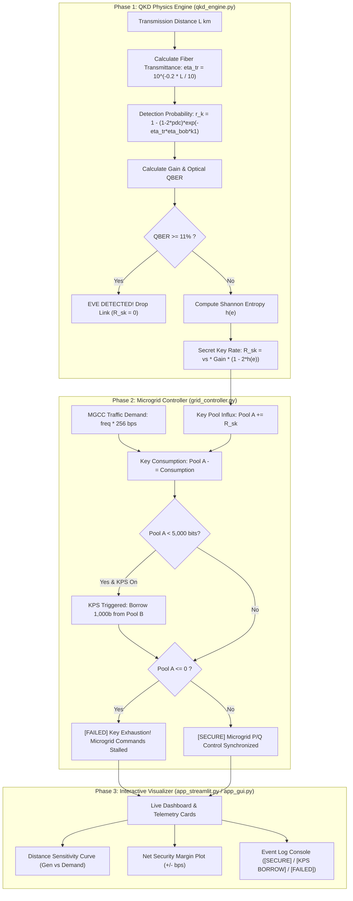

# MICROGRID STABILITY SIMULATOR

An end-to-end physics-to-cyber-physical simulation evaluating the **security and stability effect of transmission distance ($L$)** on quantum key distribution (QKD) encrypted Microgrid Control Center (MGCC) setpoint commands.

---

## 📌 1. What the Project Does

Modern smart microgrids require ultra-fast, real-time command dispatch from the **Microgrid Control Center (MGCC)** to distributed energy resources (DERs, solar inverters, battery storage). To prevent cyberattacks, every command packet must be encrypted using AES-256 symmetric keys generated via **Quantum Key Distribution (QKD)**.

### The Problem:
- Optical fiber suffers attenuation ($-0.2\text{ dB/km}$).
- As the distance ($L$) between the quantum transmitter and the microgrid substation grows, the photon transmission rate decays exponentially, causing the **Secret Key Rate ($R_{sk}$)** to crash.
- If command traffic ($N_{pkt} \times 256\text{ bps}$) exceeds key generation, the **Key Pool exhausts to zero**, halting control commands and destabilizing the microgrid!

### The Solution Simulated:
1. **Distance Security Modeling:** Accurately identifies the **Critical Distance Limit ($L_{crit}$)** beyond which a given microgrid traffic demand cannot be sustained.
2. **Key Pool Sharing (KPS):** Implements a cross-substation buffering protocol where the critical primary pool (Pool A) dynamically borrows keys from a reserve pool (Pool B) during deficits, preventing microgrid blackout.

---

## 🏛️ 2. System Architecture

The simulator is built using a **Modular 3-Tier Layered Architecture**:

```
+-------------------------------------------------------------------------+
|                  PRESENTATION & VISUALIZATION LAYER                     |
|  - Streamlit Web Dashboard (app_streamlit.py)                           |
|  - Native Tkinter Desktop GUI (app_gui.py)                              |
|  - CLI Automated Demonstrator (main.py)                                 |
+------------------------------------+------------------------------------+
                                     |
                                     v
+------------------------------------+------------------------------------+
|               CYBER-PHYSICAL GRID CONTROLLER LAYER                      |
|                      (grid_controller.py)                               |
|  - MGCC P/Q Command Generation (Packets/sec * 256 bits)                 |
|  - Real-Time Key Pool Tracking (Pool A Balance)                         |
|  - Key Pool Sharing (KPS) Engine (Borrow from Pool B if Pool A < 5000b) |
|  - Security & Stability State Machine (SECURE / FAILED)                 |
+------------------------------------+------------------------------------+
                                     |
                                     v
+------------------------------------+------------------------------------+
|                      QUANTUM PHYSICS ENGINE                             |
|                        (qkd_engine.py)                                  |
|  - Optical Fiber Loss (0.2 dB/km Attenuation)                           |
|  - Decoy-State BB84 Detection Probability & Bob Receiver Efficiency     |
|  - QBER & Binary Shannon Entropy Privacy Amplification                  |
|  - Asymptotic Secret Key Rate R_sk (bits/second)                        |
+-------------------------------------------------------------------------+
```

---

## 🔄 3. End-to-End System Flowchart



---

## ⚙️ 4. Mathematical Implementation

| Step | Metric | Formula | Meaning |
|---|---|---|---|
| 1 | **Transmittance** | $\eta_{tr} = 10^{-0.2 L / 10}$ | Optical photon survival probability over distance $L$ km. |
| 2 | **Detection Rate** | $r_k = 1 - (1 - 2p_{dc}) e^{-\eta_{tr} \eta_{bob} k_1}$ | Expected photon click rate at Bob's detector. |
| 3 | **Gain & Noise** | $\text{Gain} = r_k \cdot p_x^2$, $\text{QBER} = e_{mis} + \frac{p_{dc}}{\text{Gain}}$ | Signal rate and error fraction from misalignment and dark noise. |
| 4 | **Shannon Entropy** | $h(e) = -e \log_2(e) - (1-e) \log_2(1-e)$ | Information leakage bounding eavesdropper knowledge. |
| 5 | **Secret Key Rate** | $R_{sk} = \nu_s \cdot \text{Gain} \cdot [1 - 2 h(e)]$ | Net extractable secure bits generated per second. |
| 6 | **Grid Consumption** | $R_{cons} = f_{pkt} \times 256\text{ bps}$ | Key consumption for AES-256 setpoint encryption. |
| 7 | **Security Margin** | $\Delta R = R_{sk} - R_{cons}$ | Positive = Safe surplus; Negative = Impending exhaustion. |

---

## 🚀 5. Quick Start

### 1. Web Dashboard (Streamlit)
```bash
python -m streamlit run app_streamlit.py
```

### 2. Standalone Desktop GUI (Tkinter)
```bash
python app_gui.py
```

### 3. CLI Demonstration Suite
```bash
python main.py
```

### 4. Automated Unit Tests
```bash
python test_simulation.py
```
